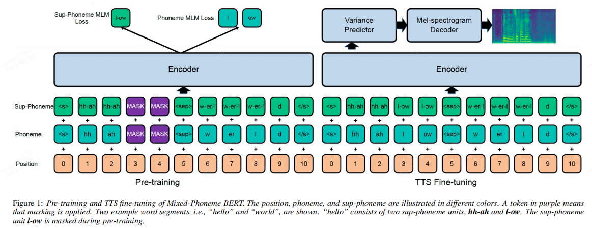

An unofficial PyTorch implementation of Mix-Phoneme-Bert([Mixed-Phoneme BERT: Improving BERT with Mixed Phoneme and Sup-Phoneme Representations for Text to Speech](https://arxiv.org/abs/2203.17190))




## Installation
This implementation is based on the fairseq library.
```
cd fairseq
```
Then follow the instructions here([fairseq](https://github.com/facebookresearch/fairseq)) to install it.

## Data Prepare
Prepare your data like file /data/data.txt
then split the data to train, test, dev sets and do some preprocessing for bpe learning.
```
bash prepare_data.sh
```
Learing bpe vocab, you can change the vocab size.
```
bash bpe.sh
```
Prepare the mmap bin files for training.
```
bash preprocess.sh
```

## Training
```
bash train.sh
```

**Note:** The learning rate and batch size are tightly connected and need to be
adjusted together. We generally recommend increasing the learning rate as you
increase the batch size according to the following table (although it's also
dataset dependent, so don't rely on the following values too closely):

batch size | peak learning rate
---|---
256 | 0.0001
2048 | 0.0005
8192 | 0.0007

You can set this parameters in fairseq/examples/roberta/config/pretraining/base.yaml

## Citations
```
@artical{zhang2022Mix-PB,
 author = {Guangyan Zhang, Kaitao Song, Xu Tan, Daxin Tan, Yuzi Yan, Yanqing Liu, Gang Wang, Wei Zhou, Tao Qin, Tan Lee, Sheng Zhao},
 title = {Mixed-Phoneme BERT: Improving BERT with Mixed Phoneme and Sup-Phoneme Representations for Text to Speech},
 url = {https://arxiv.org/abs/2203.17190}, 
 year = {2022}
}
```